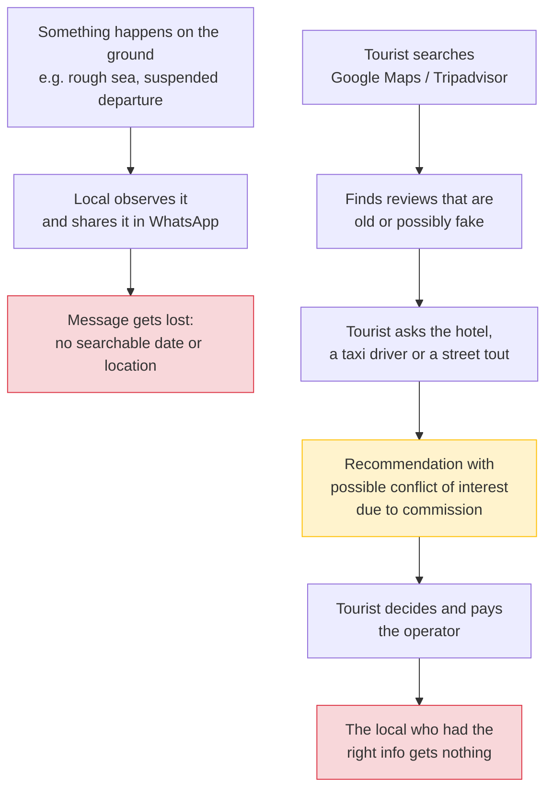
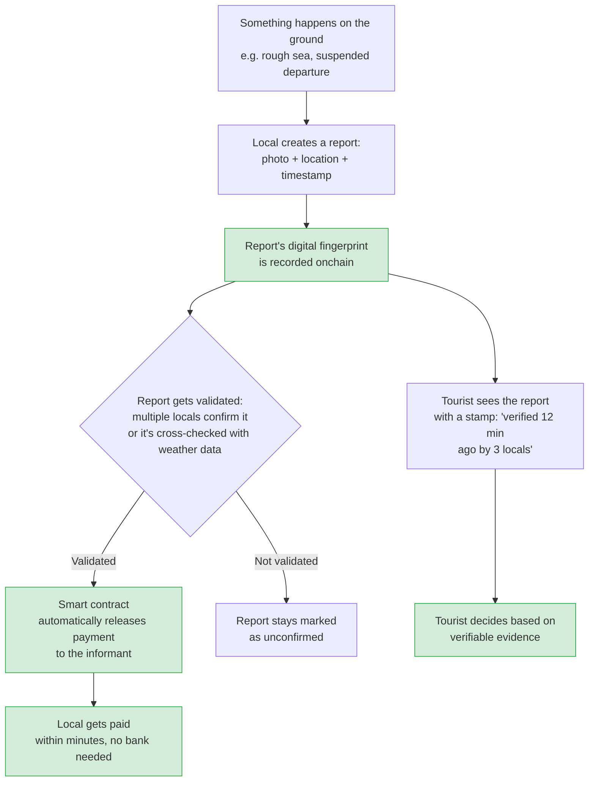

# Guaca

*Cartagena, told by the people who live it.*

Guaca is a live map of the Caribbean where locals get paid for verified, real-time reports on beaches, boats, roads and events, and every report and payment is recorded onchain so nobody can alter it afterwards.

[Leer en español](README.md)

## The problem

In Cartagena, conditions change from one day to the next: the sea gets rough, the Port Authority (Capitanía de Puerto) suspends departures to the islands, a road gets congested, or an event pops up in Getsemaní. The people who know this first are boat drivers, beach vendors, motorcycle-taxi drivers and tour guides — and they share it in WhatsApp groups. By the next day, the message is buried and never reaches any map.

Meanwhile:

- **Tourists** decide their day based on incomplete or outdated information: Tripadvisor and Google Maps reviews that can be years old, or recommendations from street intermediaries ("jaladores") who earn a commission for steering them toward a specific operator.
- **Local informants**, who actually know what's happening on the ground, give away that knowledge for free, with no recognition or pay, often without even a bank account to receive a small reward.
- **Review platforms** concentrate trust as the sole arbiter, charge hotels and operators to be featured, and nobody outside them can verify whether a report was altered or deleted.

The result: fresh information evaporates within hours, outdated or fake information competes on equal footing with the truth, and the people who create the real value — the locals observing the ground truth — capture none of it.

## Why this needs blockchain

A traditional database isn't enough, because whoever operates it is an interested party: if it charges businesses to be featured while also deciding which reports get published and who gets paid, it could alter a negative report or change the value of an already-fulfilled request, and no one outside it would ever know. This case meets three conditions that justify a decentralized ledger:

1. **Parties that don't trust each other need to share the same record** — businesses, informants and tourists all need to read the same history of reports and payments, without any single one being able to rewrite it unilaterally.
2. **The historical record must be tamper-proof** — a "verified" stamp is only meaningful if its timestamp and evidence can't be changed after the fact.
3. **It removes a middleman that currently concentrates trust** — a contract with public payment rules replaces a company's promise with a commitment anyone can verify.

## The solution

Every request for information ("Is the boat leaving from La Bodeguita dock today?") becomes a report with an identifiable author, evidence (a geotagged, timestamped photo), and a digital fingerprint recorded onchain. Once the report is validated — for example, through confirmation from multiple locals or cross-checking with weather data — a smart contract automatically releases payment to the informant, within minutes and without needing a traditional bank account.

With this:

- **Tourists** see a stamp like "verified 12 minutes ago by 3 locals" and can check it themselves, instead of blindly trusting a review.
- **Local informants** get paid within minutes, under public rules nobody can change in their favor, and build their own portable reputation.
- **Hotels and operators** can recommend places backed by verifiable evidence instead of relying on paid advertising.

## Benefits

| For | Benefit |
| :---- | :---- |
| Tourist | Fresh, verifiable information instead of stale or inflated reviews; avoids losing a travel day to bad information. |
| Local informant | Gets paid almost instantly for knowledge they currently give away for free; builds their own reputation, not a platform's. |
| Hotels and operators | Can recommend with verifiable evidence instead of paid commissions; less exposure to fake reviews. |
| Tourism ecosystem | Reduces dependence on middlemen that charge for concentrating trust; the record is auditable by anyone. |

## How it works: before and after

### Current flow (without Guaca)

### Proposed flow (with Guaca)

## Project status

Guaca is in the early problem-validation stage (Deliverable 1: Problem Brief). The team consists of Cartagena residents validating the hypothesis directly in the city.

## Team

| Member | Role |
| :---- | :---- |
| Julián García | Data scientist and DB |
| Robert López | Frontend and user experience |
| Sergio Martínez Marín | Smart contracts and backend |
| Juan David Correa | DB, user research and local community |
