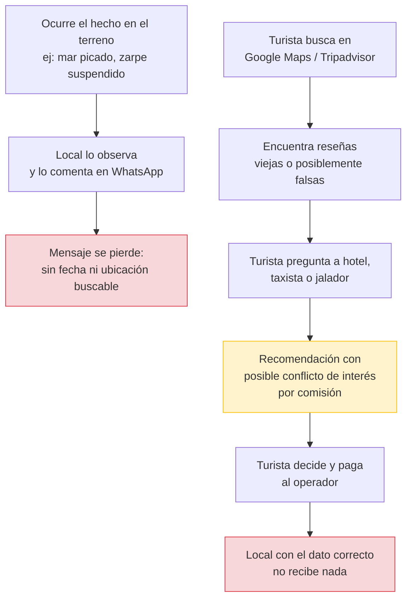
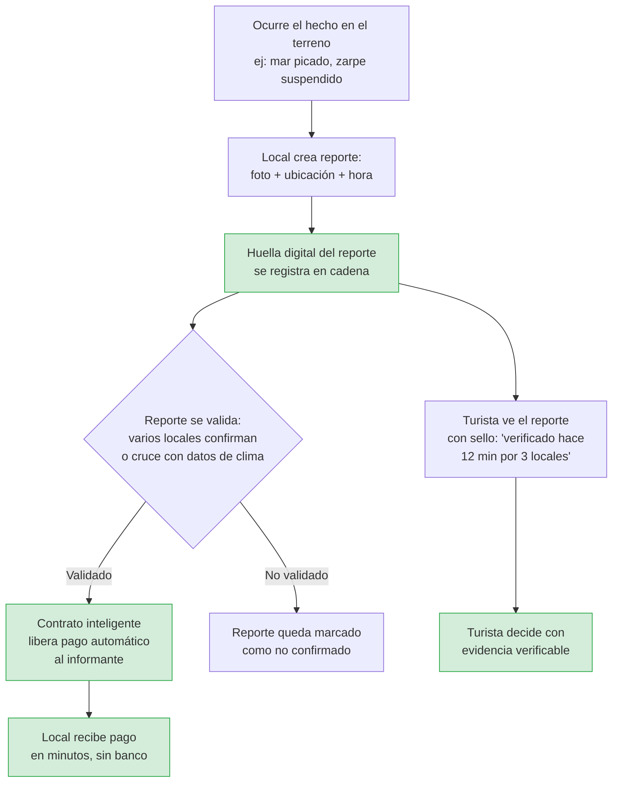

# Guaca

*Cartagena, contada por quien la vive.*

Guaca es un mapa en vivo del Caribe donde los locales reciben pago por reportes verificados y en tiempo real sobre playas, lanchas, vías y eventos, y cada reporte y cada pago queda registrado en cadena para que nadie pueda alterarlo después.

[Read this in English](README.en.md)

## El problema

En Cartagena las condiciones cambian de un día a otro: el mar se pica, la Capitanía de Puerto suspende los zarpes a las islas, una vía se congestiona o aparece un evento en Getsemaní. Quienes lo saben primero son lancheros, vendedores de playa, mototaxistas y guías, y lo cuentan en grupos de WhatsApp. Al día siguiente el mensaje queda enterrado y no llega a ningún mapa.

Mientras tanto:

- **El turista** decide su día con información incompleta o vieja: reseñas de Tripadvisor y Google Maps que pueden tener años, o recomendaciones de intermediarios ("jaladores") que cobran comisión por sugerir un operador concreto.
- **El informante local**, que sabe lo que realmente está pasando, regala ese conocimiento gratis, sin reconocimiento ni pago, muchas veces sin ni siquiera tener cuenta bancaria para recibir una pequeña recompensa.
- **Las plataformas de reseñas** concentran la confianza como árbitro único, cobran a hoteles y operadores por aparecer, y nadie fuera de ellas puede verificar si un reporte fue alterado o borrado.

El resultado: el dato fresco se evapora en horas, la información vieja o falsa compite en igualdad de condiciones con la verdadera, y quien produce el valor real —el local que observa el terreno— no capta nada de ese valor.

## Por qué esto necesita blockchain

Una base de datos tradicional no alcanza porque quien la operaría es parte interesada: si cobra a negocios por aparecer y a la vez decide qué reportes se publican y a quién se paga, podría alterar un reporte negativo o cambiar el valor de un pedido ya cumplido, y nadie lo detectaría. El caso cumple tres condiciones que justifican un registro descentralizado:

1. **Partes que no confían entre sí necesitan compartir un mismo registro** — negocios, informantes y turistas quieren leer el mismo historial de reportes y pagos, sin que ninguno pueda reescribirlo unilateralmente.
2. **El histórico no puede alterarse después** — un sello de "verificado" solo vale si su marca de tiempo y evidencia son inmutables.
3. **Se elimina un intermediario que hoy concentra la confianza** — un contrato con reglas de pago públicas reemplaza la promesa de una empresa por un compromiso verificable por cualquiera.

## La solución

Cada solicitud de información ("¿están saliendo lanchas desde La Bodeguita?") se convierte en un reporte con autor identificable, evidencia (foto con ubicación y hora) y una huella digital registrada en cadena. Cuando el reporte se valida —por ejemplo, con confirmación de varios locales o cruce con datos de clima— un contrato inteligente libera automáticamente el pago al informante, en minutos y sin necesidad de una cuenta bancaria tradicional.

Con esto:

- **El turista** ve un sello como "verificado hace 12 minutos por 3 locales" y puede comprobarlo por sí mismo, en vez de confiar ciegamente en una reseña.
- **El informante local** cobra en minutos, con reglas públicas que nadie puede cambiar a su favor, y construye una reputación propia y portable.
- **El hotel u operador** puede recomendar con evidencia verificable en vez de depender de publicidad pagada.

## Beneficios

| Para | Beneficio |
| :---- | :---- |
| Turista | Información fresca y verificable en vez de reseñas viejas o infladas; evita perder un día de viaje por un dato equivocado. |
| Informante local | Recibe pago casi inmediato por un conocimiento que hoy regala gratis; construye reputación propia, no de una plataforma. |
| Hoteles y operadores | Pueden recomendar con evidencia, no con comisión; menos exposición a reseñas falsas. |
| Ecosistema turístico | Reduce la dependencia de intermediarios que cobran por concentrar confianza; el registro es auditable por cualquiera. |

## Cómo funciona: antes y después

### Flujo actual (sin Guaca)

### Flujo propuesto (con Guaca)

## Estado del proyecto

Guaca está en etapa temprana de validación de problema (Entregable 1: Problem Brief). El equipo son residentes de Cartagena que están validando la hipótesis directamente en la ciudad.

## Equipo

| Integrante | Rol |
| :---- | :---- |
| Julián García | Data scientist y BD |
| Robert López | Frontend y experiencia de usuario |
| Sergio Martínez Marín | Contratos inteligentes y backend |
| Juan David Correa | BD, investigación de usuario y comunidad local |
