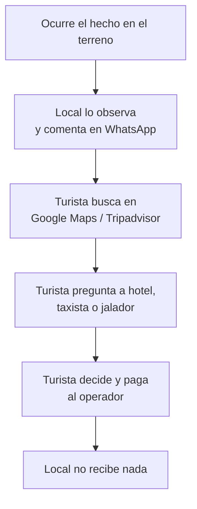
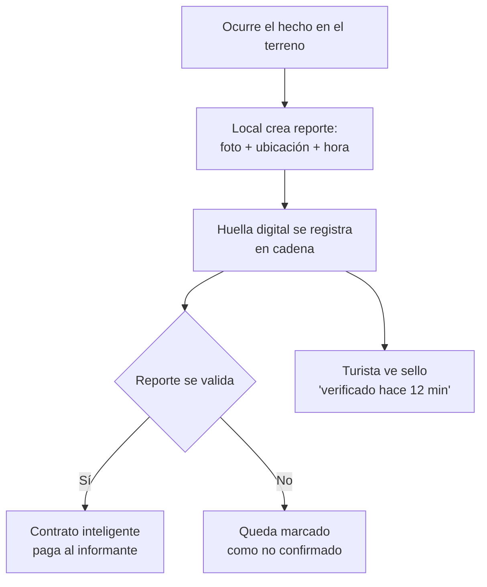

# Problem Brief

## Decisión del problema

### Problema elegido

En Cartagena, turistas y habitantes no tienen una fuente confiable y actualizada del estado real de playas, lanchas a las islas, vías y eventos, y quien produce esa información en el sitio no recibe nada por ella.

**Propuesto por:** Guaca team.

### Por qué elegimos este

Es el caso que mejor cumple los tres criterios de la Sesión 1: varias partes con intereses opuestos (turistas, informantes locales, negocios) necesitan creer en el mismo dato, ese dato pierde valor si puede alterarse después de publicado, y hoy la confianza la concentran intermediarios (plataformas de reseñas, jaladores) que no le pagan a quien realmente sabe. Además, todos los integrantes vivimos en Cartagena, así que podemos observar el problema y validarlo en la ciudad durante las cinco semanas del curso, en vez de depender de fuentes secundarias.

### Propuestas descartadas

| Propuesta | Propuesta por | Motivo del descarte |
| :---- | :---- | :---- |
| Internacionalización | Julián García | Decidimos un enfoque local controlado, más fácil de validar en cinco semanas con observación directa en Cartagena. |

### Cómo tomamos la decisión

Como grupo determinamos la situación problémica, discutimos individualmente cada propuesta (ver propuestas individuales en este mismo directorio), y desarrollamos un checklist basado en los criterios de la Sesión 1 para elegir la ruta a tratar. Llegamos a consenso tras el debate, sin necesidad de votación, porque el problema de Guaca fue el único que cumplía los tres criterios de forma clara para todos. Posteriormente hicimos un estudio de mercado local y un roadmap para el desarrollo de la idea.

---

## Problem Brief

### Encabezado

**Guaca** — En Cartagena no hay una fuente confiable y actualizada del estado de playas, lanchas, vías y eventos, y quien aporta ese dato en el sitio no recibe nada por él.

### Equipo y roles

| Integrante | Usuario de GitHub | Rol | Responsable de entregas |
| :---- | :---- | :---- | :---- |
| Julián García | julian.garc@hotmail.com | Data scientist y BD | Investigación de datos y validación cuantitativa |
| Robert López | nwrobj@gmail.com | Frontend y experiencia de usuario | Diseño de interfaz y flujo de usuario |
| Sergio Martínez Marín | sergiotechx@yahoo.com | Contratos inteligentes y backend | Arquitectura técnica y entregables de código |
| Juan David Correa | cartagenaonchain@gmail.com | BD, investigación de usuario y comunidad local | Validación en campo con informantes locales |

**Canal de coordinación interna:** grupo de WhatsApp del equipo Guaca.

### Problema y evidencia

**Contexto:** en Cartagena las condiciones cambian de un día a otro. El mar se pica, la Capitanía de Puerto suspende los zarpes a Islas del Rosario, Barú o Tierra Bomba, una vía se congestiona o aparece un evento en Getsemaní. Quienes lo saben primero son lancheros, vendedores de playa, mototaxistas y guías, y lo cuentan en grupos de WhatsApp. Al día siguiente el mensaje queda enterrado y no llega a ningún mapa.

**Frecuencia y alcance:** ocurre a diario. Hasta noviembre de 2025, la ciudad movilizó 5,5 millones de pasajeros por aire, tierra y cruceros ([El Tiempo, 2025](https://www.eltiempo.com/colombia/otras-ciudades/cartagena-cierra-2025-con-cifras-record-en-turismo-y-se-consolida-como-uno-de-los-destinos-mas-atractivos-del-caribe-3519885)), y cada visitante decide su día con información incompleta.

**Evidencia:**

1. **Observación directa:** en grupos de turistas y locales se repiten todos los días preguntas como "¿están saliendo lanchas a las islas?" o "¿cómo está Playa Blanca hoy?".
2. **Caso documentado:** el 8 de febrero de 2026, la Capitanía de Puerto ordenó evacuar la zona insular y suspendió el embarque en Playa Blanca por un frente frío ([Infobae, 2026](https://www.infobae.com/colombia/2026/02/08/ordenan-evacuar-las-islas-de-cartagena-ante-las-adversas-condiciones-climaticas-y-maritimas-que-se-esperan-las-proximas-horas/)). Quien no estaba en el chat correcto se enteró tarde.
3. **Fuente sobre confianza:** Tripadvisor reportó que cerca del 8 % de las reseñas enviadas en 2024 eran falsas ([CNBC, 2025](https://www.cnbc.com/2025/05/26/heres-how-many-fake-reviews-tripadvisor-found-on-its-website-in-2024-.html)).

### Usuario y actores

**Usuario principal: el turista.** Llega con dos o tres días y necesita decidir hoy si va a las islas, a qué playa o qué hacer en la noche. Hoy busca en Google Maps y Tripadvisor, ve TikTok e Instagram y pregunta en el hotel, al taxista o en el muelle. Le cuesta horas de planificación y, cuando el dato falla, un día perdido: pagó el tour y no hubo zarpe, o llegó a una playa con el mar picado, además de lo gastado en transporte y entradas.

**Usuario proveedor: el informante local.** Lanchero, vendedor de playa, mototaxista o guía que sabe lo que pasa en su zona. Regala ese conocimiento en chats, sin ingreso ni reconocimiento, y muchas veces sin cuenta bancaria para recibir pagos pequeños.

| Otros actores | Papel en el flujo |
| :---- | :---- |
| Hoteles, hostales y apartamentos turísticos | Recomiendan a sus huéspedes; su calificación depende de acertar. |
| Operadores de lanchas y tours | Venden el servicio; solo zarpan con autorización de la Capitanía de Puerto. |
| Capitanía de Puerto (DIMAR) | Autoriza o suspende los zarpes según el estado del mar. |
| Plataformas de reseñas y mapas | Concentran la información y cobran a negocios por publicidad y comisiones. |
| Intermediarios de calle ("jaladores") | Orientan al turista a cambio de comisión del operador. |

### Flujo actual de valor

**Hecho en el terreno → Local observa → Chat de WhatsApp → Turista consulta reseñas e intermediarios → Turista decide y paga al operador → Local recibe cero**

1. **Ocurre el hecho:** el mar se pica, la Capitanía de Puerto suspende los zarpes desde el muelle La Bodeguita o una vía se congestiona. *(Obligación normativa: las embarcaciones turísticas solo salen con zarpe autorizado por DIMAR.)*
2. **El local lo observa** y lo comenta en un grupo de WhatsApp, sin fecha visible ni ubicación asociada.
3. **El turista busca** en Google Maps o Tripadvisor y encuentra reseñas históricas. La plataforma cobra a hoteles y operadores por clic, publicidad o comisión de reserva.
4. **El turista pregunta** en el hotel, al taxista o a un jalador del Centro, quien puede cobrar comisión por recomendar un operador concreto.
5. **El turista decide y paga** al operador en efectivo o con tarjeta. *(Obligación normativa: los prestadores turísticos deben estar inscritos en el Registro Nacional de Turismo.)*
6. **El local que tenía el dato correcto no recibe nada**, y el conocimiento se pierde hasta el día siguiente.

### Fricciones identificadas

| # | Paso | Fricción | Causa | A quién afecta |
| :---- | :---- | :---- | :---- | :---- |
| F1 | 2 | El dato fresco se evapora en horas | El chat no tiene estructura, ubicación ni fecha buscable | Turistas y locales que preguntan lo mismo cada día |
| F2 | 3 | La información disponible está vieja o es falsa | Reseñas anónimas, gratuitas y acumuladas por años, con incentivos para inflarlas o atacarlas | Turista (decide mal) y negocios honestos |
| F3 | 3 y 4 | Conflicto de interés en la recomendación | Quien recomienda cobra comisión o publicidad del recomendado | Turista, que no sabe si la recomendación es neutral |
| F4 | 2 y 6 | Nadie verifica ni reconoce al que sabe | No hay registro de quién aportó qué, cuándo y con qué evidencia | Informante local |
| F5 | 6 | Pagar pequeñas recompensas es caro o imposible | Montos de pocos miles de pesos, locales sin cuenta bancaria y comisiones que superan el monto | Informante local y quien quiera pagarle |

F2 es la más costosa para el turista, porque puede perder un día de viaje. F4 es la más injusta para el local, que produce el valor y no lo captura. F5 hace que, aunque alguien quiera pagarle, el costo del pago supere la recompensa.

### Oportunidad e hipótesis

**Oportunidad priorizada: F4, con F5 como condición para resolverla.** Es la raíz de las demás: si cada reporte tiene un autor identificable, una evidencia con fecha y ubicación y un pago automático al validarse, el dato fresco deja de evaporarse (F1) y compite con ventaja frente a la reseña vieja o falsa (F2). F3 depende más de reglas editoriales que de tecnología y queda fuera del alcance de estas cinco semanas.

**Hipótesis:** si cada pedido de información (por ejemplo, "foto del muelle La Bodeguita: ¿están saliendo lanchas a las islas?") se registra en un libro distribuido con autor, lugar, hora y huella digital de la foto, y un contrato inteligente libera el pago en dólares digitales cuando el reporte se valida, entonces:

* **El turista** vería un sello como "verificado hace 12 minutos por 3 locales" y podría comprobarlo por sí mismo.
* **El informante local** cobraría en minutos, sin banco, con reglas públicas que nadie puede cambiar a su favor, y construiría una reputación propia.
* **El hotel** podría recomendar con evidencia y no con publicidad.

Para probarla mediríamos el tiempo entre el pedido y el pago, el porcentaje de reportes validados sin disputa y la disposición del turista a confiar en un dato verificable frente a una reseña tradicional.

### Criterio de pertinencia

Una base de datos tradicional no basta porque **quien opere el servicio es parte interesada**. Si cobra a hoteles y operadores por aparecer y a la vez decide qué reportes se publican y a quién se paga, podría borrar un reporte negativo sobre un cliente o cambiar el valor de un pedido ya cumplido, y nadie fuera de ella lo detectaría. El caso cumple los tres criterios de la Sesión 1:

1. **Partes que no confían entre sí comparten un registro.** El negocio quiere buena imagen, el local quiere cobrar y el turista quiere la verdad. Todos necesitan leer el mismo historial de reportes y pagos, y ninguno debería poder reescribirlo solo.
2. **El histórico no puede alterarse.** Un sello de verificación solo vale si la marca de tiempo y la evidencia no se pueden modificar después. Guardar en cadena la huella de cada foto y sus metadatos permite comprobarlo.
3. **Se elimina un intermediario que concentra la confianza.** Hoy las plataformas de reseñas son el árbitro único. Un contrato con reglas de pago públicas reemplaza la promesa de una empresa por un compromiso verificable.

Integrar sistemas existentes tampoco lo resuelve: no hay un sistema confiable del cual tomar el dato fresco, y pagar pocos miles de pesos por la vía bancaria sigue siendo caro. Las fotos no van en cadena, solo su huella y las reglas de pago.

### Supuestos y riesgos

**Supuestos que deben ser ciertos:**

1. **Los informantes aceptan cobrar en dólares digitales** y pueden convertir ese saldo en dinero útil (recarga, pago en comercio o efectivo) a bajo costo.
2. **El costo por transacción es muy inferior a la recompensa.** Si un pedido paga unos pocos miles de pesos, registrar y pagar debe costar centavos, lo que exige una red de bajo costo y agrupar operaciones.
3. **La verificación de entrada es confiable.** La cadena garantiza que el registro no cambie, no que el dato sea cierto al entrar. Suponemos que foto con ubicación y hora, cruce con datos de clima y confirmación de varios locales reducen el fraude a un nivel aceptable.

**Qué podría invalidar la hipótesis:**

* Que al turista le baste confiar en la marca; en ese caso, una base de datos con auditoría sería suficiente y más barata.
* Que la plataforma siga siendo el único oráculo que decide qué reporte es verdadero, con lo que la confianza solo se desplaza.
* Que la regulación colombiana sobre activos digitales o cambios impida o encarezca los pagos.
* Que falsificar la ubicación GPS sea barato y masivo, de modo que fingir un reporte cueste menos de lo que paga.
