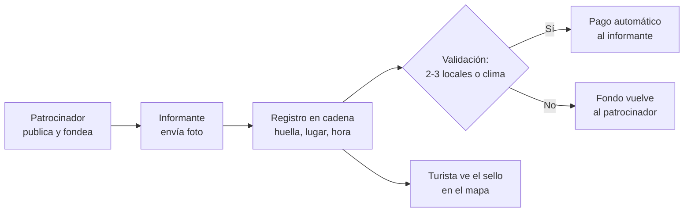
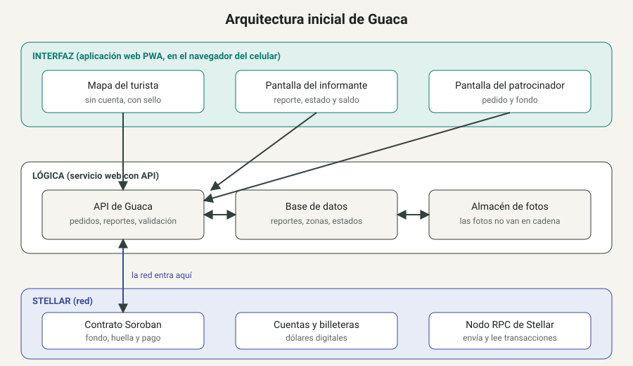
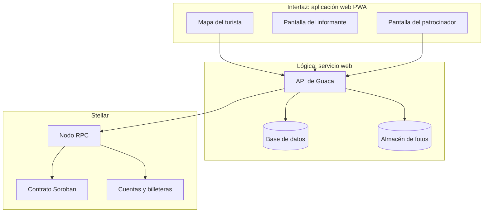

# Product Blueprint

**Nombre del proyecto:** Escriban aquí el nombre

**Repositorio (enlace obligatorio):** [Nombre del repositorio](https://github.com/usuario/repositorio)

> Los campos marcados como *enlace obligatorio* deben ir como enlace en Markdown, con este formato: `[texto del enlace](https://...)`. Reemplacen el texto y la dirección de ejemplo.

---

## Contenido

1. Priorización de historias
2. Propuesta de valor
3. Flujo de usuario
4. Alcance del MVP
5. Lean Canvas
6. Backlog priorizado (Kanban)
7. Arquitectura inicial
8. Uso de Stellar y justificación

---

## 1. Priorización de historias

> Historias elegidas entre las que propuso el equipo y criterio con que se priorizaron. Son las que pasan al backlog. Extensión: breve.

**Criterio de priorización:** MoSCoW (imprescindible / debería / podría / queda fuera). Partimos de las 28 historias individuales, incluimos la historia que cada integrante puso en primer lugar, fusionamos las que se solapan (con crédito a todos los autores) y ordenamos por su aporte a probar el ciclo completo: reporte, validación, pago y consulta del turista.

| Prioridad | Historia | Propuesta por | Por qué entra al backlog |
| :---: | --- | :---: | --- |
| 1 · Imprescindible | Como informante local quiero que el pago se libere automáticamente cuando mi reporte se valida, según reglas públicas, para no depender de que una persona decida si me paga. | Sergio | Es el núcleo que justifica usar blockchain y la promesa central de Guaca. |
| 2 · Imprescindible | Como administrador del sistema quiero que un reporte se marque como validado solo cuando lo confirmen varios locales distintos o coincida con datos de clima, para reducir el fraude antes de liberar un pago. | Julián, Juan David | La cadena garantiza que el registro no cambie, no que el dato sea cierto. Sin validación, el pago automático se puede explotar. |
| 3 · Imprescindible | Como informante local sin cuenta bancaria quiero recibir el pago en una billetera del celular que pueda crear en pocos minutos, para cobrar montos pequeños sin que las comisiones superen la recompensa. | Juan David, Sergio | Sin cobro fácil no hay incentivo para reportar. Es el supuesto 1 del Problem Brief. |
| 4 · Imprescindible | Como informante local quiero reportar con una foto, la categoría y un botón de enviar, en pocos toques y con el estado visible, para aportar rápido desde el terreno y saber qué pasó con mi reporte. | Juan David, Robert | Sin reportes fáciles de enviar el mapa se queda vacío. |
| 5 · Imprescindible | Como patrocinador de un pedido (hotel u operador) quiero depositar los fondos antes de publicarlo, para que el informante tenga la garantía de que el pago existe. | Sergio | Es la fuente de ingresos del Lean Canvas y la garantía del pago. |
| 6 · Imprescindible | Como turista quiero abrir un mapa y ver el estado actual de playas, lanchas, vías y eventos en un solo lugar, para decidir mi día sin saltar entre varias fuentes. | Robert | Es el valor central para el usuario principal del Problem Brief. |
| 7 · Imprescindible | Como turista quiero ver en cada dato su antigüedad y el número de confirmaciones ("hace 12 min · 3 locales"), para juzgar por mí mismo cuánto confiar. | Robert, Julián | Convierte la verificación en algo visible y diferencia a Guaca de las reseñas. |
| 8 · Debería | Como turista quiero usar el mapa desde el navegador, sin instalar una app, sin cuenta y sin pagar, para consultarlo en el momento que lo necesito. | Robert | Es una condición de adopción, pero el MVP puede funcionar sin pulirla. |
| 9 · Debería | Como administrador del sistema quiero recibir alertas cuando un informante envíe ubicaciones sospechosas, para detectar la falsificación del GPS antes de que cueste dinero. | Julián | Es el riesgo más serio del Problem Brief; en el MVP puede bastar una revisión manual. |
| 10 · Podría | Como patrocinador de un pedido quiero que los fondos vuelvan a mi billetera si el reporte no se valida a tiempo, para no perder dinero por un pedido que nadie cumplió. | Sergio | Protege al patrocinador, pero en el MVP se puede resolver con un plazo fijo simple. |

**Queda fuera del MVP:** puntaje de confiabilidad por informante, historial y reputación portable, impugnación de rechazos, invitación de otros locales por líderes comunitarios, pregunta directa al mapa, códigos QR de zona para hoteles, verificación en explorador público, conversión de saldo a pesos y métricas automáticas. Son valiosas, pero necesitan volumen de reportes o aliados externos que el MVP aún no tiene.

**Participación por integrante:** Sergio (1, 3, 5, 10), Julián (2, 7, 9), Juan David (2, 3, 4), Robert (4, 6, 7, 8).

---

## 2. Propuesta de valor

> Qué resultado obtiene el usuario y por qué elegiría esta solución. En qué se diferencia de cómo resuelve hoy. Conecta con el usuario del Problem Brief. Extensión: 150–300 palabras en total.

**Usuario (del Problem Brief):** El **turista**, que llega con dos o tres días y decide hoy si va a las islas o a qué playa, y el **informante local** (lanchero, vendedor de playa, mototaxista, guía), que conoce el estado real de su zona hora a hora.

**Resultado que obtiene:**

* **Turista:** decide su día con un dato fresco y verificable, con un sello como "verificado hace 12 min por 3 locales", y no pierde un día de viaje por un dato viejo.
* **Informante local:** cobra en minutos por un reporte validado, sin cuenta bancaria, y construye una reputación propia con su historial.

**Por qué elegiría esta solución:**

* **Turista:** ve en un solo mapa qué pasa ahora mismo, sin instalar nada, sin registrarse y sin pagar. Puede comprobar por sí mismo la antigüedad y las confirmaciones de cada dato.
* **Informante local:** hoy regala lo que sabe en WhatsApp. Con Guaca reporta con una foto en pocos toques, ve el estado de su reporte y recibe un pago con reglas públicas que nadie puede cambiar a su favor.

**En qué se diferencia de cómo lo resuelve hoy:** Google Maps y Tripadvisor acumulan reseñas anónimas, con años de antigüedad y con incentivos para inflarlas o atacarlas (Tripadvisor reportó cerca de 8 % de reseñas falsas en 2024). Nadie fuera de la plataforma puede comprobar si una reseña fue alterada o borrada. Guaca muestra solo reportes recientes, con autor identificable, foto con lugar y hora, y un registro que nadie puede reescribir después. Además, la persona que produce el dato recibe el pago, algo que ninguna plataforma de reseñas hace hoy.

---

## 3. Flujo de usuario

> Recorrido de la persona por la solución de principio a fin, roles y puntos de interacción. Diagrama o secuencia numerada. Extensión: 150–300 palabras.

| Paso | Rol | Qué hace | Punto de interacción |
| :---: | :---: | --- | --- |
| 1 | Patrocinador (hotel u operador) | Publica un pedido, por ejemplo "¿están saliendo lanchas desde La Bodeguita?", y deposita el fondo de la recompensa. | Pantalla de pedidos y billetera del patrocinador; el fondo queda bloqueado en la red. |
| 2 | Informante local | Ve el pedido, toma una foto y la envía con la categoría. La primera vez se crea su billetera en pocos minutos. | Pantalla de reporte en el celular; billetera. |
| 3 | Sistema | Registra en la red la huella de la foto, el lugar, la hora y el autor. | Registro en cadena (Stellar). |
| 4 | Otros locales | Dos o tres locales distintos confirman o desmienten el reporte con un toque, o el sistema lo cruza con datos de clima. | Pantalla de confirmación; servicio de clima. |
| 5 | Sistema | Si se valida, libera el pago al informante; si no, lo marca como no confirmado y el fondo vuelve al patrocinador. | Contrato inteligente (Stellar). |
| 6 | Informante local | Ve el estado de su reporte (enviado, en validación, pagado o rechazado) y su saldo en pesos. | Pantalla de estado; billetera. |
| 7 | Turista | Abre el mapa desde el navegador, sin cuenta, y ve el estado actual con el sello "hace 12 min · 3 locales". | Mapa web (PWA). |
| 8 | Turista | Decide su día y, si quiere, comprueba el registro del reporte. | Mapa; explorador público de la red. |

El recorrido cubre las siete historias imprescindibles del backlog: el pedido y el fondo (5), el reporte (4), la billetera (3), la validación (2), el pago automático (1), el mapa (6) y el sello (7).

---

## 4. Alcance del MVP

> Funcionalidad central separada de la deseable que queda fuera. Justificación de por qué el recorte sigue entregando valor. Extensión: 150–300 palabras en total.

| Dentro del MVP (funcionalidad central) | Fuera del MVP (deseable, para después) |
| --- | --- |
| Una zona (muelle La Bodeguita e islas) y una categoría: lanchas y estado del mar. | Otras zonas y categorías: playas, vías y eventos. |
| El patrocinador publica un pedido y deposita el fondo, que queda bloqueado en un contrato. | Devolución automática del fondo si el pedido vence sin validarse. |
| El informante reporta con foto, categoría y envío, y ve el estado de su reporte. | Historial, puntaje de confiabilidad y reputación portable. |
| Billetera creada en el celular al primer reporte y pago en dólares digitales, mostrado en pesos. | Conversión del saldo a pesos, recargas y pago en comercios. |
| Validación por la confirmación de 2 locales distintos, con registro de la huella de la foto, el lugar y la hora en cadena. | Cruce con datos de clima y alertas de ubicaciones sospechosas (revisión manual mientras tanto). |
| Pago automático al validarse, por reglas públicas. | Impugnación de reportes rechazados. |
| Mapa web sin cuenta, con el estado actual y el sello "hace X min · N locales". | Pregunta directa al mapa, códigos QR por zona y explorador público de la red. |

**Por qué el recorte sigue entregando valor:** el MVP recorre el ciclo completo de la hipótesis del Problem Brief (pedido, reporte, validación, pago y consulta) en el caso mejor documentado: los zarpes desde La Bodeguita, que Juan David puede validar en campo. Con una sola zona y una sola categoría se puede medir lo que realmente prueba la hipótesis: el tiempo entre el pedido y el pago, el porcentaje de reportes validados sin disputa y el costo por transacción frente a la recompensa. Lo que queda fuera mejora la calidad o el alcance, pero necesita volumen de reportes o aliados externos que todavía no existen. Sin el depósito real y el pago automático no habría razón para usar una red como Stellar, por eso se mantienen dentro.

---

## 5. Lean Canvas

> Lienzo de una página con el modelo del producto. Extensión: enlace (obligatorio).

**Enlace al Lean Canvas (obligatorio):** [Lean Canvas del proyecto](https://htmlpreview.github.io/?https://github.com/Cartagenaonchain/Guaca/blob/main/docs/semana2/LeanCanvas.html)

El lienzo debe cubrir: problema, segmento de usuarios, propuesta de valor única, solución, canales, métricas clave, ventaja diferencial y estructura de costos e ingresos.

---

## 6. Backlog priorizado (Kanban)

> Enlace al tablero en GitHub Projects, construido con las historias priorizadas, en columnas y con criterios de aceptación por tarjeta. Extensión: enlace al tablero (obligatorio).

**Enlace al tablero (obligatorio):** [Tablero Kanban en GitHub Projects](https://github.com/users/usuario/projects/1)

---

## 7. Arquitectura inicial

> Cómo se conectan las partes (interfaz, lógica, Stellar) y en qué punto entra la red. Diagrama simple en imagen. Extensión: 150–300 palabras en total.

**Diagrama (imagen o enlace):** 

| Capa | Componente | Qué hace |
| :---: | --- | --- |
| Interfaz | Aplicación web (PWA) con tres pantallas | Mapa del turista sin cuenta, reporte y saldo del informante, y pedido y fondo del patrocinador. |
| Lógica | API de Guaca | Crea pedidos, recibe reportes, cuenta las confirmaciones y decide cuándo un reporte queda validado. |
| Lógica | Base de datos y almacén de fotos | Guardan reportes, zonas y estados, y las fotos (las fotos no van en cadena). |
| Lógica | Servicio de billeteras | Crea la cuenta del informante al primer reporte y guarda su clave cifrada en el servidor. |
| Stellar | Contrato Soroban | Guarda el fondo del patrocinador, registra la huella de cada reporte y libera el pago al validarse. |
| Stellar | Cuentas y billeteras | Guardan el saldo de los informantes en dólares digitales. |

**En qué punto entra la red:** la red entra en tres momentos: cuando el patrocinador deposita el fondo, cuando se registra la huella de la foto con su lugar y hora, y cuando la API informa que el reporte se validó y el contrato paga. Todo lo demás (mapa, fotos, conteo de confirmaciones) se hace fuera de la red para mantener el costo por transacción en centavos. Al custodiar las claves de los informantes, Guaca simplifica el cobro, pero asume un riesgo de custodia que debe explicarse a los usuarios.

---

## 8. Uso de Stellar y justificación

> Qué componentes de Stellar usaría y por qué cada uno. Apoyado en el criterio de pertinencia del Problem Brief. Extensión: 150–300 palabras en total.

**Criterio de pertinencia (del Problem Brief):** una base de datos tradicional no basta porque quien opere el servicio es parte interesada: si cobra a hoteles y operadores y a la vez decide qué reportes se publican y a quién se paga, podría borrar un reporte negativo o cambiar el valor de un pedido cumplido sin que nadie lo detecte. Por eso se necesita un registro compartido, que no pueda alterarse después, con reglas de pago públicas que reemplacen la promesa de una empresa.

| Componente de Stellar | Para qué lo usamos | Por qué ese y no otra alternativa |
| --- | --- | --- |
| Contrato inteligente (Soroban) | Guarda el fondo del patrocinador, registra la huella de cada reporte con su lugar y hora, y libera el pago cuando se validan las confirmaciones. | Una base de datos con auditoría la controla quien la opera, que podría cambiar un pago o borrar un reporte. Con un contrato, las reglas son públicas y el histórico no se puede reescribir. |
| Cuentas y activo estable (USDC) con trustline | Cada informante tiene una cuenta y recibe su recompensa en dólares digitales, sin cuenta bancaria. | El pago bancario de unos pocos miles de pesos es caro o imposible sin banco. Una cuenta en Stellar se crea en minutos y cada pago cuesta centavos, por debajo de la recompensa. Un activo estable evita que el saldo del local pierda valor. |
| Anclas y rampas de salida (SEP-24) | Después del MVP: convertir el saldo en pesos, recarga o efectivo. | Sin salida a pesos, el saldo tiene menos uso para el local. Es una integración con aliados externos, por eso queda fuera del MVP. |

Guaca guarda las claves de los informantes para que cobrar sea fácil. Eso reintroduce un punto de confianza en la custodia, pero no en el registro ni en el pago: el fondo y las reglas de pago siguen siendo públicos y verificables en la red.
